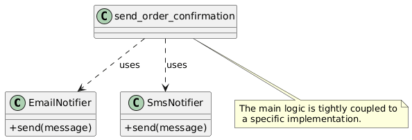
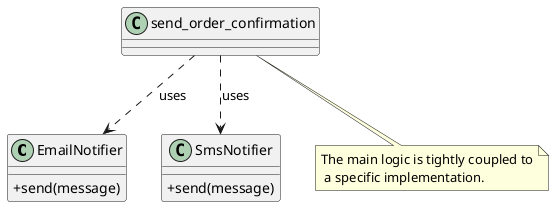
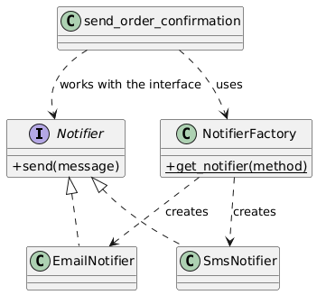
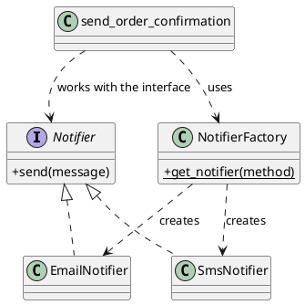
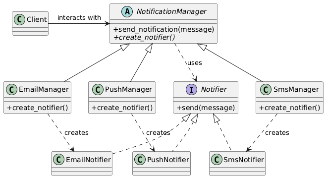
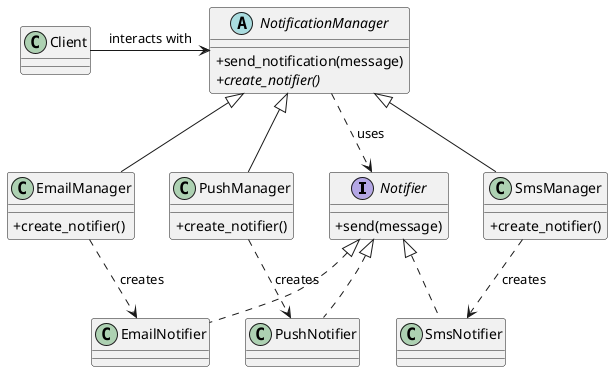

Of course. Let's break down the Factory Method from the ground up. It's a classic pattern, but textbook examples often jump into the final, abstract solution without showing you the problem it's trying to solve. Forget that complex code for a moment.

We'll build up to it step-by-step, starting with the problem itself.

### The Core Problem: Tight Coupling

Imagine you're building a system that sends notifications. You start simple, just with email.

```python
# The "bad" way - tightly coupled code
class EmailNotifier:
    def send(self, message: str) -> None:
        print(f"Sending email: '{message}'")

# Your main application logic
def send_order_confirmation(message: str):
    # Problem here: We are directly creating an EmailNotifier instance.
    # Our high-level logic is now dependent on a low-level detail.
    notifier = EmailNotifier()
    notifier.send(message)

send_order_confirmation("Your order #123 is confirmed!")
```

This works perfectly fine. But now, your boss says, "We need to add SMS notifications\!"

So, you modify your main logic:

```python
# Still the "bad" way - getting worse
class SmsNotifier:
    def send(self, message: str) -> None:
        print(f"Sending SMS: '{message}'")

def send_order_confirmation(message: str, method: str):
    # Yikes! An if/else block for object creation.
    # This block will grow and become a pain point.
    if method == "email":
        notifier = EmailNotifier()
    elif method == "sms":
        notifier = SmsNotifier()
    else:
        raise ValueError("Invalid notification method")

    notifier.send(message)

send_order_confirmation("Your package is shipped!", method="sms")
```

This is a **maintenance nightmare**. Every time you add a new notification type (Push, Slack, etc.), you have to go back and modify this core `send_order_confirmation` function. This violates two key SOLID principles:

1.  **Single Responsibility Principle (SRP):** This function's job is to orchestrate sending a confirmation. It shouldn't also be responsible for knowing how to create every single type of notifier.
2.  **Open/Closed Principle (OCP):** The function should be **open for extension** (adding new notifiers) but **closed for modification** (we shouldn't have to change its existing code). Our `if/elif` block forces us to modify it.

-----

### Level 1: A Simple Factory (A Good First Step)

The first step to fixing this is to move the messy creation logic into its own dedicated place. This is often called a **Simple Factory**. It's not the full "Factory Method" pattern, but it's a huge improvement.

**Analogy:** Think of a restaurant kitchen. Your main logic is the customer. The customer doesn't go into the kitchen and assemble the pizza (`EmailNotifier`) themselves. They just tell the waiter, "I want a pizza" (`'email'`). The kitchen (`NotifierFactory`) is responsible for creating the actual pizza object.

```python
# A better way - using a Simple Factory
class NotifierFactory:
    @staticmethod
    def get_notifier(method: str):
        if method == "email":
            return EmailNotifier()
        elif method == "sms":
            return SmsNotifier()
        # Add a new 'push' notifier? Just add one 'elif' here.
        else:
            raise ValueError("Invalid notification method")

# Our main logic is now clean!
def send_order_confirmation(message: str, method: str):
    # It just asks the factory for the object it needs.
    # It has no idea how an EmailNotifier or SmsNotifier is created.
    notifier = NotifierFactory.get_notifier(method)
    notifier.send(message)

send_order_confirmation("Your order is delivered!", method="email")
```

This is much better\! Our main logic is **decoupled** from the concrete `EmailNotifier` and `SmsNotifier` classes. If we add a `PushNotifier`, we only have to modify the `NotifierFactory`, not our main application code.



But we can do even better. What if different parts of your application have different notification logic? For example, the "Marketing" part of your app can only send emails, while the "Logistics" part can only send SMS. This is where the true **Factory Method** pattern shines.

-----

### Level 2: The Factory Method Pattern (The Expert Level)

The Factory Method pattern adds one more layer of abstraction. It says: "Let's define a blueprint for creating objects, but let the child classes decide *which specific object* to create."

**Analogy Update:** Instead of one central kitchen (`NotifierFactory`), imagine you have specialized kitchens. You have a `PizzaHutManager` and a `DominosManager`. Both have a method called `create_pizza()`. The customer interacts with the `PizzaHutManager`, and when they ask for a pizza, they get a Pizza Hut pizza, without ever needing to know the specifics. They are just interacting with the "Manager" interface.

Let's rebuild your original example, explaining it piece by piece.

1.  **Product Interface (`Notifier`):** This is the blueprint for the objects we want to create. It guarantees that every notifier, no matter what kind, will have a `.send()` method.

    ```python
    from abc import ABC, abstractmethod

    class Notifier(ABC): # The "Product"
        @abstractmethod
        def send(self, message: str) -> None:
            pass
    ```

2.  **Concrete Products (`EmailNotifier`, `SmsNotifier`):** These are the actual objects we're creating. They implement the Product interface.

    ```python
    class EmailNotifier(Notifier): # A "Concrete Product"
        def send(self, message: str) -> None:
            print(f"Sending email: '{message}'")

    class SmsNotifier(Notifier): # Another "Concrete Product"
        def send(self, message: str) -> None:
            print(f"Sending SMS: '{message}'")
    ```

3.  **Creator Class (`NotificationManager`):** This is the key part. It's an abstract class that defines two things:

      * Some main business logic that is **stable** and **doesn't change** (`send_notification`). This logic uses the product.
      * An abstract **factory method** (`create_notifier`) that the child classes *must* implement. This is the part that will **vary**.

    <!-- end list -->

    ```python
    class NotificationManager(ABC): # The "Creator"
        # This is the stable, high-level logic.
        # Notice it calls the factory method to get the object.
        def send_notification(self, message: str) -> None:
            notifier = self.create_notifier()
            notifier.send(message)

        # This is the Factory Method. It's abstract.
        # It forces subclasses to decide what kind of notifier to create.
        @abstractmethod
        def create_notifier(self) -> Notifier:
            pass
    ```

4.  **Concrete Creators (`EmailManager`, `SmsManager`):** These are the specialized kitchens. Their *only job* is to implement the factory method and provide the specific object.

    ```python
    class EmailManager(NotificationManager): # A "Concrete Creator"
        def create_notifier(self) -> Notifier:
            # It decides to create an EmailNotifier.
            return EmailNotifier()

    class SmsManager(NotificationManager): # Another "Concrete Creator"
        def create_notifier(self) -> Notifier:
            # It decides to create an SmsNotifier.
            return SmsNotifier()
    ```

Now, the client code decides which "Manager" it wants to work with, and the manager handles the rest.

```python
# --- Client Code ---
email_manager = EmailManager()
email_manager.send_notification("Your order has been shipped!")
# Output: Sending email: 'Your order has been shipped!'

sms_manager = SmsManager()
sms_manager.send_notification("Your package is out for delivery.")
# Output: Sending SMS: 'Your package is out for delivery.'
```

The client code (`email_manager.send_notification(...)`) doesn't know or care that an `EmailNotifier` is being created. It's just talking to a `NotificationManager`.

**Now, how do we add a `PushNotifier`?** We don't touch *any* of the existing code. We just add two new classes (perfectly following the Open/Closed principle):

```python
# 1. Add the new Concrete Product
class PushNotifier(Notifier):
    def send(self, message: str) -> None:
        print(f"Sending push notification: '{message}'")

# 2. Add the new Concrete Creator
class PushManager(NotificationManager):
    def create_notifier(self) -> Notifier:
        return PushNotifier()

# And it just works!
push_manager = PushManager()
push_manager.send_notification("Your driver has arrived.")
# Output: Sending push notification: 'Your driver has arrived.'
```

-----

### How to Ace This in an Interview 🎯

  * **The Elevator Pitch:** "The Factory Method is a creational design pattern that provides an interface for creating objects in a superclass, but allows subclasses to alter the type of objects that will be created. It lets you decouple your main application logic from the specific types of objects it needs to create."

  * **Key Benefit:** It promotes **loose coupling** and adheres to the **Single Responsibility** and **Open/Closed** principles. You can introduce new product types without modifying the client code that uses them.

  * **Trade-offs:**

      * **Pro:** Highly extensible, great for frameworks or libraries where the user needs to provide their own component types.
      * **Con:** The biggest downside is the **increase in complexity**. You have to introduce a whole hierarchy of classes (`Creator`, `ConcreteCreator`, etc.) which can feel like overkill for simpler cases. For those simpler cases, a **Simple Factory** is often a more pragmatic choice. Mentioning this trade-off shows senior-level thinking.

  * **Real-World Backend Scenarios:**

      * **Document Exporter:** A `DocumentManager` (Creator) has a `export()` method. `PdfManager` and `CsvManager` (Concrete Creators) implement `create_exporter()` to return a `PdfExporter` or `CsvExporter` object.
      * **Payment Gateway Integration:** A `PaymentProcessor` (Creator) has a `process_payment()` method. `StripeProcessor` and `PayPalProcessor` (Concrete Creators) implement `create_gateway()` to return the correct API client.
      * **Database Connectors:** A generic `DatabaseManager` needs to get a connection. `PostgresManager` and `MySQLManager` could implement a `get_connection()` factory method to return the specific database driver connection.

---

# UML Diagrams Code
Use [PlantUML](https://www.plantuml.com/plantuml/uml/) to create UML diagrams. Below are diagrams for each stage we discussed.

-----

### 1\. Tight Coupling

The `agent` element has been replaced with a `class` to properly represent the client code in a class diagram context.




-----

### 2\. Simple Factory

As we discussed, this version replaces the `agent` with a `class` named `Client` that represents the code calling the factory.





-----

### 3\. Factory Method Pattern

Here, the `actor` element has been replaced with a `class` called `Client`, which is the standard way to show the entity that interacts with the Creator classes.



